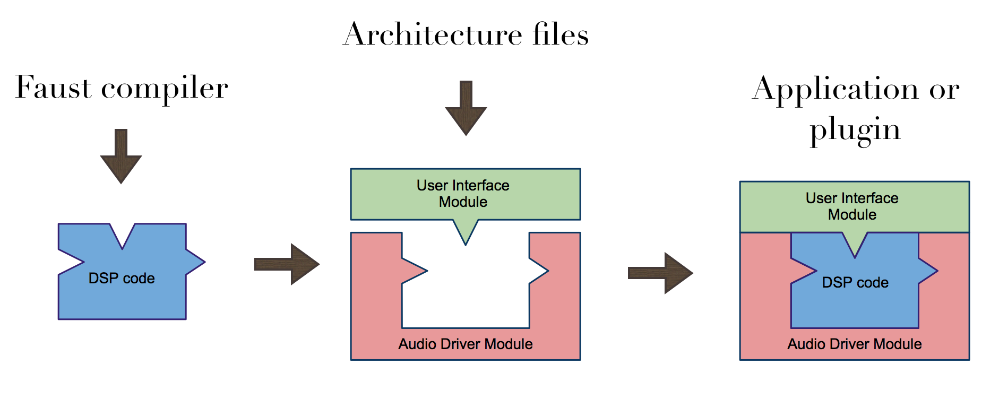
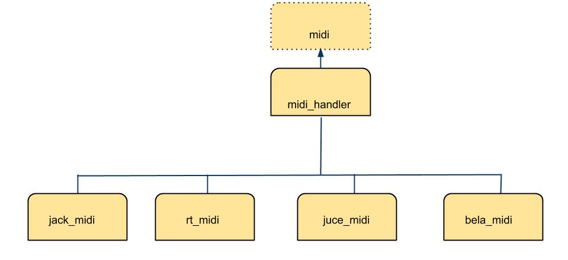
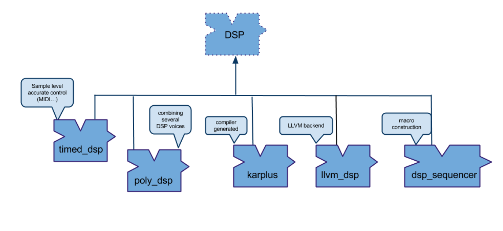

# Architecture Files

A Faust program describes a *signal processor*, a pure DSP computation that maps *input signals* to *output signals*. It says nothing about audio drivers or controllers (like GUI, OSC, MIDI, sensors) that are going to control the DSP. This additional information is provided by *architecture files*.

An *architecture file* describes how to relate a Faust program to the external world, in particular the audio drivers and the controllers interfaces to be used. This approach allows a single Faust program to be easily deployed to a large variety of audio standards (e.g., Max/MSP externals, PD externals, VST plugins, CoreAudio applications, JACK applications, iPhone/Android, etc.):



The architecture to be used is specified at compile time with the `-a` option. For example `faust -a jack-gtk.cpp foo.dsp` indicates to use the JACK GTK architecture when compiling `foo.dsp`.

## Minimal structure of an architecture file

Before going into the details of the architecture files provided with FAUST distribution, it is important to have an idea of the essential parts that compose an architecture file. Technically, an architecture file is any text file with two placeholders `<<includeIntrinsic>>` and `<<includeclass>>`. The first placeholder is currently not used, and the second one is replaced by the code generated by the FAUST compiler. 

Therefore, the _really minimal_ architecture file, let's call it `nullarch.cpp`, is the following:
    
    <<includeIntrinsic>>
    <<includeclass>>

This `nullarch.cpp` architecture has the property that `faust foo.dsp` and `faust -a nullarch.cpp foo.dsp` produce the same result. Obviously, this is not very useful, moreover the resulting `cpp` file doesn't compile. 

Here is `miniarch.cpp`, a minimal architecture file that contains enough information to produce a `cpp` file that can be successfully compiled:

```c++
<<includeIntrinsic>>

#define FAUSTFLOAT float

class dsp {};

struct Meta
{
    virtual void declare(const char* key, const char* value) {};
    
};

struct Soundfile {
    FAUSTFLOAT** fBuffers;
    int* fLength;   // length of each part
    int* fSR;       // sample rate of each part
    int* fOffset;   // offset of each part in the global buffer
    int fChannels;  // max number of channels of all concatenated files
};

struct UI
{
    // -- widget's layouts
    virtual void openTabBox(const char* label) {}
    virtual void openHorizontalBox(const char* label) {}
    virtual void openVerticalBox(const char* label) {}
    virtual void closeBox() {}
    
    // -- active widgets
    virtual void addButton(const char* label, FAUSTFLOAT* zone) {}
    virtual void addCheckButton(const char* label, FAUSTFLOAT* zone) {}
    virtual void addVerticalSlider(const char* label, FAUSTFLOAT* zone, FAUSTFLOAT init, FAUSTFLOAT min, FAUSTFLOAT max, FAUSTFLOAT step) {}
    virtual void addHorizontalSlider(const char* label, FAUSTFLOAT* zone, FAUSTFLOAT init, FAUSTFLOAT min, FAUSTFLOAT max, FAUSTFLOAT step) {}
    virtual void addNumEntry(const char* label, FAUSTFLOAT* zone, FAUSTFLOAT init, FAUSTFLOAT min, FAUSTFLOAT max, FAUSTFLOAT step) {}
    
    // -- passive widgets
    virtual void addHorizontalBargraph(const char* label, FAUSTFLOAT* zone, FAUSTFLOAT min, FAUSTFLOAT max) {}
    virtual void addVerticalBargraph(const char* label, FAUSTFLOAT* zone, FAUSTFLOAT min, FAUSTFLOAT max) {}
    
    // -- soundfiles
    virtual void addSoundfile(const char* label, const char* filename, Soundfile** sf_zone) {}
    
    // -- metadata declarations
    virtual void declare(FAUSTFLOAT* zone, const char* key, const char* val) {}
};


<<includeclass>>
```

This architecture is still not very useful, but it gives an idea of what a real-life architecture file has to implement, in addition to the audio part itself. As we will see in the next section, Faust architectures are implemented using a modular approach to avoid code duplication and favor code maintenance and reuse.


## Audio Architecture Modules

Some of these architectures are a modular combination of an *audio module* and one or more *controller modules*. Among these user interface modules `OSCUI` provides supports for Open Sound Control allowing Faust programs to be controlled by OSC messages. 

Some architecture only combine an *audio module* with the generated DSP to create an *audio engine* to be controlled with an additional `setParamValue/getParamValue` kind of API, so that the controller part can be completeley defined externally. This is the purpose of the `faust2api` script explained later on.  

An *audio architecture module* typically connects a Faust program to the audio drivers. It is responsible for allocating and releasing the audio channels and for calling the Faust `dsp::compute` method to handle incoming audio buffers and/or to produce audio output. It is also responsible for presenting the audio as non-interleaved float data, normalized between -1.0 and 1.0. 

The default compilation model uses separated audio input and output buffers not referring to the same memory locations. The `-inpl (--in-place)` code generation model allows us to generate code working when *input and output buffers are the same* (which is typically needed in some embedded devices). This option currently only works in scalar (= default) code generation mode.

A Faust audio architecture module derives from an *audio* class can be defined as below (simplified version, see the [real version here)](https://github.com/grame-cncm/faust/blob/master-dev/architecture/faust/audio/audio.h):

```c++
class audio {
     
    public:
    
        audio() {}
        virtual ~audio() {}
    
        /**
         * Init the DSP.
         * @param name - the DSP name to be given to the audio driven 
         * (could appear as a JACK client for instance)
         * @param dsp - the dsp that will be initialized with the driver sample rate
         *
         * @return true is sucessful, false if case of driver failure.
         **/
        virtual bool init(const char* name, dsp* dsp) = 0;
    
        /**
         * Start audio processing.
         * @return true is sucessfull, false if case of driver failure.
         **/
        virtual bool start() = 0;
        
        /**
         * Stop audio processing.
         **/
        virtual void stop() = 0;
        
        void setShutdownCallback(shutdown_callback cb, void* arg) = 0;
    
         // Return buffer size in frames.
        virtual int getBufferSize() = 0;
    
        // Return the driver sample rate in Hz.
        virtual int getSampleRate() = 0;

        // Return the driver hardware inputs number.
        virtual int getNumInputs() = 0;
    
        // Return the driver hardware outputs number.
        virtual int getNumOutputs() = 0;
        
        /**
        * @return Returns the average proportion of available CPU 
        * being spent inside the audio callbacks (between 0.0 and 1.0).
        **/
        virtual float getCPULoad() = 0;
};
```

The API is simple enough to give a great flexibility to audio architectures implementations. The  `init` method should initialize the audio. At  `init` exit, the system should be in a safe state to recall the  `dsp` object state. Here is the hierarchy of some of the supported audio drivers:


## MIDI Architecture Modules

A *MIDI architecture module* typically connects a Faust program to the MIDI drivers. MIDI control connects DSP parameters with MIDI messages (in both directions), and can be used to trigger polyphonic instruments.

#### MIDI Messages in the DSP Source Code

MIDI control messages are described as metadata in UI elements. They are decoded by a `MidiUI` class, subclass of `UI`, which parses incoming MIDI messages and updates the appropriate control parameters, or sends MIDI messages when the UI elements (sliders, buttons...) are moved.

#### Defined Standard MIDI Messages

A special `[midi:xxx yyy...]` metadata needs to be added to the UI element. The full description of supported MIDI messages is now part of the [Faust documentation](https://faustdoc.grame.fr/manual/midi/).

#### MIDI Classes

A `midi` base class defining MIDI messages decoding/encoding methods has been developed. It will be used to receive and transmit MIDI messages:

```c++
class midi {

public:

    midi() {}
    virtual ~midi() {}

    // Additional time-stamped API for MIDI input
    virtual MapUI* keyOn(double, int channel, int pitch, int velocity)
    {
        return keyOn(channel, pitch, velocity);
    }
    
    virtual void keyOff(double, int channel, int pitch, int velocity = 0)
    {
        keyOff(channel, pitch, velocity);
    }

    virtual void keyPress(double, int channel, int pitch, int press)
    {
        keyPress(channel, pitch, press);
    }
    
    virtual void chanPress(double date, int channel, int press)
    {
        chanPress(channel, press);
    }

    virtual void pitchWheel(double, int channel, int wheel)
    {
        pitchWheel(channel, wheel);
    }
       
    virtual void ctrlChange(double, int channel, int ctrl, int value)
    {
        ctrlChange(channel, ctrl, value);
    }

    virtual void ctrlChange14bits(double, int channel, int ctrl, int value)
    {
        ctrlChange14bits(channel, ctrl, value);
    }

    virtual void rpn(double, int channel, int ctrl, int value)
    {
        rpn(channel, ctrl, value);
    }

    virtual void progChange(double, int channel, int pgm)
    {
        progChange(channel, pgm);
    }

    virtual void sysEx(double, std::vector<unsigned char>& message)
    {
        sysEx(message);
    }

    // MIDI sync
    virtual void startSync(double date)  {}
    virtual void stopSync(double date)   {}
    virtual void clock(double date)  {}

    // Standard MIDI API
    virtual MapUI* keyOn(int channel, int pitch, int velocity)      { return nullptr; }
    virtual void keyOff(int channel, int pitch, int velocity)       {}
    virtual void keyPress(int channel, int pitch, int press)        {}
    virtual void chanPress(int channel, int press)                  {}
    virtual void ctrlChange(int channel, int ctrl, int value)       {}
    virtual void ctrlChange14bits(int channel, int ctrl, int value) {}
    virtual void rpn(int channel, int ctrl, int value)              {}
    virtual void pitchWheel(int channel, int wheel)                 {}
    virtual void progChange(int channel, int pgm)                   {}
    virtual void sysEx(std::vector<unsigned char>& message)         {}

    enum MidiStatus {
        // channel voice messages
        MIDI_NOTE_OFF = 0x80,
        MIDI_NOTE_ON = 0x90,
        MIDI_CONTROL_CHANGE = 0xB0,
        MIDI_PROGRAM_CHANGE = 0xC0,
        MIDI_PITCH_BEND = 0xE0,
        MIDI_AFTERTOUCH = 0xD0,         // aka channel pressure
        MIDI_POLY_AFTERTOUCH = 0xA0,    // aka key pressure
        MIDI_CLOCK = 0xF8,
        MIDI_START = 0xFA,
        MIDI_CONT = 0xFB,
        MIDI_STOP = 0xFC,
        MIDI_SYSEX_START = 0xF0,
        MIDI_SYSEX_STOP = 0xF7
    };

    enum MidiCtrl {
        ALL_NOTES_OFF = 123,
        ALL_SOUND_OFF = 120
    };

    enum MidiNPN {
        PITCH_BEND_RANGE = 0
    };
};
```
A [midi_hander](https://github.com/grame-cncm/faust/blob/master-dev/architecture/faust/midi/midi.h#L261) subclass implements actual MIDI decoding and *maintains a list of MIDI aware components* (classes inheriting from `midi` and ready to send and/or receive MIDI events) using the `addMidiIn/removeMidiIn` methods:


```c++
class midi_handler : public midi {

    protected:

        std::vector<midi*> fMidiInputs;
        std::string fName;
        MidiNRPN fNRPN;

    public:

        midi_handler(const std::string& name = "MIDIHandler"):fName(name) {}
        virtual ~midi_handler() {}

        void addMidiIn(midi* midi_dsp) {...}
        void removeMidiIn(midi* midi_dsp) {...}
        ...
        ...
};
```


Several concrete implementations subclassing `midi_handler` using native APIs have been written and can be found in the [faust/midi](https://github.com/grame-cncm/faust/tree/master-dev/architecture/faust/midi) folder:



Depending on the native MIDI API being used, event time-stamps are either expressed in absolute time or in frames. They are converted to offsets expressed in samples relative to the beginning of the audio buffer.

Connected with the `MidiUI` class (a subclass of `UI`), they allow a given DSP to be controlled with incoming MIDI messages or possibly send MIDI messages when its internal control state changes.

In the following piece of code, a `MidiUI` object is created and connected to a `rt_midi` MIDI messages handler (using the [RTMidi](http://www.music.mcgill.ca/~gary/rtmidi/) library), then given as a parameter to the standard `buildUserInterface` to control DSP parameters:

```c++
...
rt_midi midi_handler("MIDI");
MidiUI midiinterface(&midi_handler);
DSP->buildUserInterface(&midiinterface);
...
```


## UI Architecture Modules

A UI architecture module links user actions (i.e., via graphic widgets, command line parameters, OSC messages, etc.) with the Faust program to control. It is responsible for associating program parameters to user interface elements and to update parameter’s values according to user actions. This association is triggered by the `dsp::buildUserInterface` call, where the `dsp` asks a UI object to build the DSP module controllers.

Since the interface is basically graphic-oriented, the main concepts are *widget* based: a UI architecture module is semantically oriented to handle active widgets, passive widgets and widgets layout.

A Faust UI architecture module derives the `UI` base class: 

```c++
template <typename REAL>
struct UIReal {
  
    UIReal() {}
    virtual ~UIReal() {}

    // -- widget's layouts

    virtual void openTabBox(const char* label) = 0;
    virtual void openHorizontalBox(const char* label) = 0;
    virtual void openVerticalBox(const char* label) = 0;
    virtual void closeBox() = 0;

    // -- active widgets

    virtual void addButton(const char* label, REAL* zone) = 0;
    virtual void addCheckButton(const char* label, REAL* zone) = 0;
    virtual void addVerticalSlider(const char* label, REAL* zone, REAL init, 
                                   REAL min, REAL max, REAL step) = 0;
    virtual void addHorizontalSlider(const char* label, REAL* zone, REAL init, 
                                     REAL min, REAL max, REAL step) = 0;
    virtual void addNumEntry(const char* label, REAL* zone, REAL init, 
                             REAL min, REAL max, REAL step) = 0;

    // -- passive widgets

    virtual void addHorizontalBargraph(const char* label, REAL* zone, REAL min, REAL max) = 0;
    virtual void addVerticalBargraph(const char* label, REAL* zone, REAL min, REAL max) = 0;

    // -- soundfiles

    virtual void addSoundfile(const char* label, const char* filename, Soundfile** sf_zone) = 0;

    // -- metadata declarations

    virtual void declare(REAL* zone, const char* key, const char* val) {}
};

struct UI : public UIReal<FAUSTFLOAT>
{
    UI() {}
    virtual ~UI() {}
};
```

Here is part of the UI classes hierarchy:


#### Active Widgets

Active widgets are graphical elements controlling a parameter value. They are initialized with the widget name and a pointer to the linked value, using the `FAUSTFLOAT` macro type (defined at compile time as either `float` or `double`). Active widgets in Faust are `Button`, `CheckButton`, `VerticalSlider`, `HorizontalSlider` and `NumEntry`.

A GUI architecture must implement a method `addXxx(const char* name, FAUSTFLOAT* zone, ...)` for each active widget. Additional parameters are available for `Slider` and `NumEntry`: the `init`, `min`, `max` and `step` values.

#### Passive Widgets

Passive widgets are graphical elements reflecting values. Similarly to active widgets, they are initialized with the widget name and a pointer to the linked value. Passive widgets in Faust are `HorizontalBarGraph` and `VerticalBarGraph`.

A UI architecture must implement a method `addXxx(const char* name, FAUSTFLOAT* zone, ...)` for each passive widget. Additional parameters are available, depending on the passive widget type.

#### Widgets Layout

Generally, a GUI is hierarchically organized into boxes and/or tab boxes. A UI architecture must support the following methods to setup this hierarchy:

```c++
  openTabBox(const char* label);
  openHorizontalBox(const char* label);
  openVerticalBox(const char* label);
  closeBox(const char* label);
```

Note that all the widgets are added to the current box.

#### Metadata

The Faust language allows widget labels to contain metadata enclosed in square brackets as key/value pairs. These metadata are handled at GUI level by a declare method taking as argument, a pointer to the widget associated zone, the metadata key and value:

```c++
declare(FAUSTFLOAT* zone, const char* key, const char* value);
```

Here is the table of currently supported general medatada:

| Key     | Value                 |
| ------- | --------------------- |
| tooltip | actual string content |
| hidden  | 0 or 1                |
| unit    | *Hz* or *dB*          |
| scale    | *log* or *exp*      |
| style    | *knob* or *led* or *numerical*   |
| style    | *radio{’label1’:v1;’label2’:v2...}*      |
| style    | *menu{’label1’:v1;’label2’:v2...}*       |
| acc  | *axe curve amin amid amax*       |
| gyr | *axe curve amin amid amax*       |
| screencolor    | *red* or *green* or *blue* or *white* |

Here `acc` means *accelerometer* and `gyr` means *gyroscope*, both use the same parameters (a mapping description) but are linked to different sensors.

Some typical example where several metadata are defined could be:

```
nentry("freq [unit:Hz][scale:log][acc:0 0 -30 0 30][style:menu{’white noise’:0;’pink noise’:1;’sine’:2}][hidden:0]", 0, 20, 100, 1)
```

or:

```
vslider("freq [unit:dB][style:knob][gyr:0 0 -30 0 30]", 0, 20, 100, 1)
```

When one or several metadata are added in the same item label, then will appear in the generated code as one or successives `declare(FAUSTFLOAT* zone, const char* key, const char* value);` lines *before* the line describing the item itself. Thus the UI managing code has to associate them with the proper item. Look at the [MetaDataUI](https://github.com/grame-cncm/faust/blob/master-dev/architecture/faust/gui/MetaDataUI.h) class for an example of this technique.

Note that medatada are not supported in all architecture files. Some of them like (`acc` or `gyr` for example) only make sense on platforms with accelerometers or gyroscopes sensors. The set of medatada may be extended in the future and can possibly be adapted for a specific project. They can be decoded using the `MetaDataUI`class.


#### DSP JSON Description 

The full description of a given compiled DSP can be generated as a JSON file, to be used at several places in the architecture system. This JSON describes the DSP with its inputs/outputs number, some metadata (filename, name, used compilation parameters, used libraries etc.) as well as its UI with a hierarchy of groups up to terminal items (buttons, sliders, nentries, bargraphs) with all their parameters (label, metadata, init, min, max and step values). For the following DSP program:


```
import("stdfaust.lib");
vol = hslider("volume [unit:dB]", 0, -96, 0, 0.1) : ba.db2linear : si.smoo;
freq = hslider("freq [unit:Hz]", 600, 20, 2000, 1);

process = vgroup("Oscillator", os.osc(freq) * vol) <: (_,_);
```

The generated JSON file is then:

```json
{
    "name": "osc",
    "filename": "osc.dsp",
    "version": "2.28.0",
    "compile_options": "-lang cpp -scal -ftz 0",
    "library_list": [],
    "include_pathnames": [],
    "inputs": 0,
    "outputs": 2,
    "meta": [
    ],
    "ui": [ 
        {
            "type": "vgroup",
            "label": "Oscillator",
            "items": [ 
                {
                    "type": "hslider",
                    "label": "freq",
                    "address": "/Oscillator/freq",
                    "meta": [
                        { "unit": "Hz" }
                    ],
                    "init": 600,
                    "min": 20,
                    "max": 2000,
                    "step": 1
                },
                {
                    "type": "hslider",
                    "label": "volume",
                    "address": "/Oscillator/volume",
                    "meta": [
                        { "unit": "dB" }
                    ],
                    "init": 0,
                    "min": -96,
                    "max": 0,
                    "step": 0.1
                }
            ]
        }
    ]
}
```

The JSON file can be generated with `faust -json foo.dsp` command, or by programs using the `JSONUI` UI architecture (see next *Some Useful UI Classes* section).

Here is the description of ready-to-use UI classes, followed by classes to be used in developer code:

#### GUI Builders

Here is the description of the main GUI classes:

- the [GTKUI](https://github.com/grame-cncm/faust/blob/master-dev/architecture/faust/gui/GTKUI.h) class uses the [GTK](https://www.gtk.org) toolkit to create a Graphical User Interface with a proper group-based layout
- the [QTUI](https://github.com/grame-cncm/faust/blob/master-dev/architecture/faust/gui/QTUI.h) class uses the [QT](https://www.qt.io) toolkit to create a Graphical User interface with a proper group based layout
- the [JuceUI](https://github.com/grame-cncm/faust/blob/master-dev/architecture/faust/gui/JuceUI.h) class uses the [JUCE](https://juce.com) framework to create a Graphical User interface with a proper group based layout

#### Non-GUI Controllers

Here is the description of the main non-GUI controller classes:

- the [OSCUI](https://github.com/grame-cncm/faust/blob/master-dev/architecture/faust/gui/OSCUI.h) class implement OSC remote control in both directions
- the [httpUI](https://github.com/grame-cncm/faust/blob/master-dev/architecture/faust/gui/httpUI.h) class implement HTTP remote control using the [libmicrohttpd](https://www.gnu.org/software/libmicrohttpd/) library to embed a HTTP server inside the application. Then by opening a browser on a specific URL, the GUI will appear and allow to control the distant appliction or plugin. The connection works in both directions
- the [MIDIUI](https://github.com/grame-cncm/faust/blob/master-dev/architecture/faust/gui/MIDIUI.h) class implement MIDI  control in both directions, and it explained more deeply later on

#### Some Useful UI Classes for Developers 

Some useful UI classes can possibly be reused in developer code:

- the [MapUI](https://github.com/grame-cncm/faust/blob/master-dev/architecture/faust/gui/MapUI.h) class establishes a mapping beween UI items and their labels or paths, and offers a `setParamValue/getParamValue` API to set and get their values. It uses an helper [PathBuilder](https://github.com/grame-cncm/faust/blob/master-dev/architecture/faust/gui/PathBuilder.h) class to create complete pathnames to the final items in the UI hierarchy 
- the extended [APIUI](https://github.com/grame-cncm/faust/blob/master-dev/architecture/faust/gui/APIUI.h) offers `setParamValue/getParamValue` API similar to `MapUI`, with additional methods to deal with accelerometer/gyroscope kind of metadata
- the [MetaDataUI](https://github.com/grame-cncm/faust/blob/master-dev/architecture/faust/gui/MetaDataUI.h) class decodes all currently supported metadata and can be used to retrieve their values 
- the [JSONUI](https://github.com/grame-cncm/faust/blob/master-dev/architecture/faust/gui/JSONUI.h) class allows us to generate the JSON description of a given DSP 
- the [FUI](https://github.com/grame-cncm/faust/blob/master-dev/architecture/faust/gui/FUI.h) class allows us to save and restore the parameters state as a text file
- the [SoundUI](https://github.com/grame-cncm/faust/blob/master-dev/architecture/faust/gui/SoundUI.h) class with the associated [Soundfile](https://github.com/grame-cncm/faust/blob/master-dev/architecture/faust/gui/Soundfile.h) class is used to implement the `soundfile` primitive, and load the described audio resources (typically audio files), by using different concrete implementations, either using [libsndfile](http://www.mega-nerd.com/libsndfile/) (with the [LibsndfileReader.h](https://github.com/grame-cncm/faust/blob/master-dev/architecture/faust/gui/LibsndfileReader.h) file), or [JUCE](https://juce.com) (with the [JuceReader](https://github.com/grame-cncm/faust/blob/master-dev/architecture/faust/gui/JuceReader.h) file). A new audio file loader can possibly be written by subclassing the `SoundfileReader` class. A pure memory reader could be implemented for instance to load wavetables to be used as the`soundfile` URL list. Look at the template [MemoryReader](https://github.com/grame-cncm/faust/blob/master-dev/architecture/faust/gui/MemoryReader.h) class, as an example to be completed. 

#### Multi-Controller and Synchronization 

A given DSP can perfectly be controlled by  several UI classes at the same time, and they will all read and write the same DSP control memory zones. Here is an example of code using a GUI using `GTKUI` architecture, as well as OSC control using `OSCUI`:

```c++
...
GTKUI interface(name, &argc, &argv);
DSP->buildUserInterface(&interface);
OSCUI oscinterface(name, argc, argv);
DSP->buildUserInterface(&oscinterface);
...
```
Since several controller *access* the same values, you may have to synchronize them, in order for instance to have the GUI sliders or buttons *reflect the state* that would have been changed by the `OSCUI` controller at reception time, of have OSC messages *been sent* each time UI items like sliders or buttons are moved.   

This synchronization mecanism is implemented in a generic way in the [GUI](https://github.com/grame-cncm/faust/blob/master-dev/architecture/faust/gui/GUI.h) class, which defines  the `uiItem` class as the basic synchronizable memory zone, then grouped in a list controlling the same zone from different GUI instances. The `uiItem::modifyZone` method is used to change the `uiItem` state at reception time, and `uiItem::reflectZone`will be called to refect a new value, and can change the Widget layout for instance, or send a message (OSC, MIDI...).

All classes needing to use this synchronization mechanism will have to subclass the `GUI` class, which keeps all of them at runtime in a global `GUI::fGuiList` variable.

Finally the static `GUI::updateAllGuis()` synchronization method will have to be called regularly, in the application or plugin event management loop, or in a periodic timer for instance.

  


## DSP Architecture Modules

The Faust compiler produces a DSP module whose format will depend of the chosen backend: a C++ class with the `-lang cpp` option, a data structure with associated functions with the `-lang c` option, an LLVM IR module  with the `-lang llvm` option, a WebAssembly binary module with the `-lang wasm` option, a bytecode stream with the `-lang interp` option... and so on.

### The Base `dsp` Class

In C++, the generated class derives from a base `dsp` class:

```c++
class dsp {

public:

    dsp() {}
    virtual ~dsp() {}

    /* Return instance number of audio inputs */
    virtual int getNumInputs() = 0;

    /* Return instance number of audio outputs */
    virtual int getNumOutputs() = 0;

    /**
     * Trigger the ui_interface parameter with instance specific calls
     * to 'openTabBox', 'addButton', 'addVerticalSlider'... in order to build the UI.
     *
     * @param ui_interface - the user interface builder
     */
    virtual void buildUserInterface(UI* ui_interface) = 0;

    /* Return the sample rate currently used by the instance */
    virtual int getSampleRate() = 0;

    /**
     * Global init, calls the following methods:
     * - static class 'classInit': static tables initialization
     * - 'instanceInit': constants and instance state initialization
     *
     * @param sample_rate - the sampling rate in Hz
     */
    virtual void init(int sample_rate) = 0;

    /**
     * Init instance state
     *
     * @param sample_rate - the sampling rate in Hz
     */
    virtual void instanceInit(int sample_rate) = 0;

    /**
     * Init instance constant state
     *
     * @param sample_rate - the sampling rate in HZ
     */
    virtual void instanceConstants(int sample_rate) = 0;

    /* Init default control parameters values */
    virtual void instanceResetUserInterface() = 0;

    /* Init instance state (like delay lines..) but keep the control parameter values */
    virtual void instanceClear() = 0;
 
    /**
     * Return a clone of the instance.
     *
     * @return a copy of the instance on success, otherwise a null pointer.
     */
    virtual dsp* clone() = 0;

    /**
     * Trigger the Meta* parameter with instance specific calls to 'declare' 
     * (key, value) metadata.
     *
     * @param m - the Meta* meta user
     */
    virtual void metadata(Meta* m) = 0;

    /**
     * DSP instance computation, to be called with successive in/out audio buffers.
     *
     * @param count - the number of frames to compute
     * @param inputs - the input audio buffers as an array of non-interleaved 
     * FAUSTFLOAT samples (eiher float, double or quad)
     * @param outputs - the output audio buffers as an array of non-interleaved 
     * FAUSTFLOAT samples (eiher float, double or quad)
     *
     */
    virtual void compute(int count, FAUSTFLOAT** inputs, FAUSTFLOAT** outputs) = 0;

    /**
     * DSP instance computation: alternative method to be used by subclasses.
     *
     * @param date_usec - the timestamp in microsec given by audio driver.
     * @param count - the number of frames to compute
     * @param inputs - the input audio buffers as an array of non-interleaved 
     * FAUSTFLOAT samples (either float, double or quad)
     * @param outputs - the output audio buffers as an array of non-interleaved 
     * FAUSTFLOAT samples (either float, double or quad)
     *
     */
    virtual void compute(double date_usec, int count, 
                         FAUSTFLOAT** inputs, 
                         FAUSTFLOAT** outputs) = 0;
};
```

For a given compiled DSP program, the compiler will generate a `mydsp` subclass of `dsp` and fill the different methods (the actual name can be changed using the `-cn` option). For dynamic code producing backends like the LLVM IR, SOUL or the Interpreter ones, the actual code (an LLVM module, a SOUL module or C++ class, or a bytecode stream) is actually wrapped by some additional C++ code glue, to finally produces  a `llvm_dsp` typed object (defined in the [llvm-dsp.h](https://github.com/grame-cncm/faust/blob/master-dev/architecture/faust/dsp/llvm-dsp.h) file), a `soulpatch_dsp`  typed object (defined in the [soulpatch-dsp.h](https://github.com/grame-cncm/faust/blob/master-dev/architecture/faust/dsp/soulpatch-dsp.h) file) or an `interpreter_dsp` typed object (defined in [interpreter-dsp.h](https://github.com/grame-cncm/faust/blob/master-dev/architecture/faust/dsp/interpreter-dsp.h) file), ready to be used  with the `UI` and `audio`  C++ classes (like the C++ generated class). See the following class diagram:



### Macro Construction of DSP Components

The Faust program specification is usually entirely done in the language itself. But in some specific cases it may be useful to develop *separated DSP components* and *combine* them in a more complex setup.

Since taking advantage of the huge number of already available UI and audio architecture files is important, keeping the same `dsp` API is preferable, so that more complex DSP can be controlled and audio rendered the usual way. Extended DSP classes will typically subclass the `dsp` base class and override or complete part of its API. 

#### Combining DSP

##### Dsp Decorator Pattern

A `dsp_decorator` class, subclass of the root `dsp` class has first been defined. Following the decorator design pattern, it allows behavior to be added to an individual object, either statically or dynamically.

As an example of the decorator pattern, the `timed_dsp` class allows to decorate a given DSP with sample accurate control capability or  the `mydsp_poly` class for polyphonic DSPs, explained in the next sections.

##### Combining DSP Components

A few additional macro construction classes, subclasses of the root dsp class have been defined in the [dsp-combiner.h](https://github.com/grame-cncm/faust/blob/master-dev/architecture/faust/dsp/dsp-combiner.h) header file:

- the `dsp_sequencer` class combines two DSP in sequence, assuming that the number of outputs of the first DSP equals the number of input of the second one. Its `buildUserInterface` method is overloaded to group the two DSP in a tabgroup, so that control parameters of both DSPs can be individually controlled. Its `compute` method is overloaded to call each DSP `compute` in sequence, using an intermediate output buffer produced by first DSP as the input one given to the second DSP.
<!-- TODORM: la fin de cette dernière phrase est pas claire, on a du mal à comprendre quoi est quoi -->
- the `dsp_parallelizer`  class combines two DSP in parallel. Its `getNumInputs/getNumOutputs` methods are overloaded by correctly reflecting the input/output of the resulting DSP as the sum of the two combined ones. Its `buildUserInterface` method is overloaded to group the two DSP in a tabgroup, so that control parameters of both DSP can be individually controlled. Its `compute` method is overloaded to call each DSP compute, where each DSP consuming and producing its own number of input/output audio buffers taken from the method parameters.

And so on for other DSP algebraic operators. This end up with a C++ API to combine DSPs with the usual 5 operators: `createDSPSequencer`, `createDSPParallelizer`, `createDSPSplitter`, `createDSPMerger`, `createDSPRecursiver` that can possibly be used at C++ level to dynamically combine DSPs (defined in the [dsp-combiner.h](https://github.com/grame-cncm/faust/blob/master-dev/architecture/faust/dsp/dsp-combiner.h) header). 

### Sample Accurate Control

DSP audio languages usually deal with several timing dimensions when treating control events and generating audio samples. For performance reasons, systems maintain separated audio rate for samples generation and control rate for asynchronous messages handling.

The audio stream is most often computed by blocks, and control is updated between blocks. To smooth control parameter changes, some languages chose to interpolate parameter values between blocks.

In some cases control may be more finely interleaved with audio rendering, and some languages simply choose to interleave control and sample computation at sample level.

Although the Faust language permits the description of sample level algorithms (i.e., like recursive filters, etc.), Faust generated DSP are usually computed by blocks. Underlying audio architectures give a fixed size buffer over and over to the DSP `compute` method which consumes and produces audio samples.

##### Control to DSP Link

In the current version of the Faust generated code, the primary connection point between the control interface and the DSP code is simply a memory zone. For control inputs, the architecture layer continuously write values in this zone, which is then *sampled* by the DSP code at the beginning of the compute method, and used with the same values during the entire call. Because of this simple control/DSP connexion mechanism, the *most recent value* is seen by the DSP code.

Similarly for control outputs , the DSP code inside the `compute` method possibly writes several values at the same memory zone, and the *last value* only will be seen by the control architecture layer when the method finishes.

Although this behaviour is satisfactory for most use-cases, some specific usages need to handle the complete stream of control values with sample accurate timing. For instance keeping all control messages and handling them at their exact position in time is critical for proper MIDI clock synchronisation.

##### Time-Stamped Control

The first step consists in extending the architecture control mechanism to deal with *time-stamped* control events. Note that this requires the underlying event control layer to support this capability. The native MIDI API for instance is usually able to deliver time-stamped MIDI messages.

The next step is to keep all time-stamped events in a *time ordered* data structure to be continuously written by the control side, and read by the audio side.

Finally the sample computation has to take account of all queued control events, and correctly change the DSP control state at successive points in time.

##### Slices Based DSP Computation

With time-stamped control messages, changing control values at precise sample indexes on the audio stream becomes possible. A generic *slices based* DSP rendering strategy has been implemented in the [timed_dsp](https://github.com/grame-cncm/faust/blob/master-dev/architecture/faust/dsp/timed-dsp.h) class.

A ring-buffer is used to transmit the stream of time-stamped events from the control layer to the DSP one. In the case of MIDI control for instance, the ring-buffer is written with a pair containing the time-stamp expressed in samples and the actual MIDI message each time one is received. In the DSP compute method, the ring-buffer will be read to handle all messages received during the previous audio block.

Since control values can change several times inside the same audio block, the DSP compute cannot be called only once with the total number of frames and the complete inputs/outputs audio buffers. The following strategy has to be used:

- several slices are defined with control values changing between consecutive slices
- all control values having the same time-stamp are handled together, and change the DSP control internal state. The slice is computed up to the next control parameters time-stamp until the end of the given audio block is reached
- in the next figure, four slices with the sequence of c1, c2, c3, c4 frames are successively given to the DSP compute method, with the appropriate part of the audio input/output buffers. Control values (appearing here as *[v1,v2,v3]*, then *[v1,v3]*, then *[v1]*, then *[v1,v2,v3]* sets) are changed between slices


Since time-stamped control messages from the previous audio block are used in the current block, control messages are aways handled with one audio buffer latency.

### Polyphonic Instruments

Directly programing polyphonic instruments in Faust is perfectly possible. It is also needed if very complex signal interaction between the different voices have to be described.

But since all voices would always be computed, this approach could be too CPU costly for simpler or more limited needs. In this case describing a single voice in a Faust DSP program and externally combining several of them with a special polyphonic instrument aware architecture file is a better solution. Moreover, this special architecture file takes care of dynamic voice allocations and control MIDI messages decoding and mapping.

#### Polyphonic-Ready DSP Code

By convention Faust architecture files with polyphonic capabilities expect to find control parameters named `freq`, `gain`, and `gate`. The metadata `declare nvoices "8";` kind of line with a desired value of voices can be added in the source code.

In the case of MIDI control, the freq parameter (which should be a frequency) will be automatically computed from MIDI note numbers, gain (which should be a value between 0 and 1) from velocity and gate from keyon/keyoff events. Thus, gate can be used as a trigger signal for any envelope generator, etc.

#### Using the `mydsp_poly` Class

The single voice has to be described by a Faust DSP program, the `mydsp_poly` class is then used to combine several voices and create a polyphonic ready DSP:

- the [poly-dsp.h](https://github.com/grame-cncm/faust/blob/master-dev/architecture/faust/dsp/poly-dsp.h) file contains the definition of the `mydsp_poly` class used to wrap the DSP voice into the polyphonic architecture. This class maintains an array of `dsp*`objects, manage dynamic voice allocation, control MIDI messages decoding and mapping, mixing of all running voices, and stopping a voice when its output level decreases below a given threshold
- as a subclass of DSP, the `mydsp_poly` class redefines the `buildUserInterface` method. By convention all allocated voices are grouped in a global  *Polyphonic* tabgroup. The first tab contains a *Voices* group, a master like component used to change parameters on all voices at the same time, with a *Panic* button to be used to stop running voices, followed by one tab for each voice. Graphical User Interface components will then reflect the multi-voices structure of the new polyphonic DSP 


The resulting polyphonic DSP object can be used as usual, connected with the needed audio driver, and possibly other `UI` control objects like `OSCUI`, `httpdUI`, etc. Having this new UI hierarchical view allows complete OSC control of each single voice and their control parameters, but also all voices using the master component.

The following OSC messages reflect the same DSP code either compiled normally, or in polyphonic mode (only part of the OSC hierarchies are displayed here):

```
// Mono mode

/Organ/vol f -10.0
/Organ/pan f 0.0
```

```
// Polyphonic mode

/Polyphonic/Voices/Organ/pan f 0.0
/Polyphonic/Voices/Organ/vol f -10.0
...
/Polyphonic/Voice1/Organ/vol f -10.0
/Polyphonic/Voice1/Organ/pan f 0.0
...
/Polyphonic/Voice2/Organ/vol f -10.0
/Polyphonic/Voice2/Organ/pan f 0.0
```

The polyphonic instrument allocation takes the DSP to be used for one voice, the desired number of voices, the dynamic voice allocation state, and the group state which controls if separated voices are displayed or not:

```c++
dsp* poly = new mydsp_poly(dsp, 2, true, true);
```

With the following code, note that a polyphonic instrument may be used outside of a MIDI control context, so that all voices will be always running and possibly controlled with OSC messages for instance:

```c++
dsp* poly = new mydsp_poly(dsp, 8, false, true);
```

#### Polyphonic Instrument With a Global Output Effect

Polyphonic instruments may be used with an output effect. Putting that effect in the main Faust code is generally not a good idea since it would be instantiated for each voice which would be very inefficient. 

A convention has been defined to use the `effect = some effect;` line in the DSP source code. The actual effect definition has to be extracted from the DSP code, compiled separately, and then combined using the `dsp_sequencer` class previously presented to connect the polyphonic DSP in sequence with a unique global effect, with something like:

```c++
dsp* poly = new dsp_sequencer(new mydsp_poly(dsp, 2, true, true), new effect());
```

| 


Some helper classes like the base [dsp_poly_factory](https://github.com/grame-cncm/faust/blob/master-dev/architecture/faust/dsp/poly-dsp.h#L897) class, and concrete implementations  [llvm_dsp_poly_factory](https://github.com/grame-cncm/faust/blob/master-dev/architecture/faust/dsp/poly-llvm-dsp.h) when using the LLVM backend or [interpreter_dsp_poly_factory](https://github.com/grame-cncm/faust/blob/master-dev/architecture/faust/dsp/poly-interpreter-dsp.h) when using the Interpreter backend can also be used to automatically handle the voice and effect part of the DSP.

#### Controlling the Polyphonic Instrument

The `mydsp_poly` class is also ready for MIDI control and can react to `keyOn/keyOff` and `pitchWheel` events. Other MIDI control parameters can directly be added in the DSP source code as MIDI metadata. To receive MIDI events, the created polyphonic DSP has to be explicitly added in a MIDI handler with the following line:

```c++
midi_handler.addMidiIn(dsp_poly);
```

#### Deploying the Polyphonic Instrument

Several architecture files and associated scripts have been updated to handle polyphonic instruments:

As an example on OSX, the script `faust2caqt foo.dsp` can be used to create a polyphonic CoreAudio/QT application. The desired number of voices is either declared in a `nvoices` metadata or changed with the `-nvoices num` additional parameter. MIDI control is activated using the `-midi` parameter.

The number of allocated voices can possibly be changed at runtime using the` -nvoices` parameter to change the default value (so using `./foo -nvoices 16` for instance). Several other scripts have been adapted using the same conventions.

```
faustcaqt -midi -noices 12 inst.dsp -effect effect.dsp
```

with `inst.dsp` and `effect.dsp` in the same folder, and the number of outputs of the instrument matching the number of inputs of the effect, has to be used. 

Polyphonic-ready `faust2xx` scripts will then compile the polyphonic instrument and the effect, combine them in sequence, and create a ready-to-use DSP.

### The Proxy DSP Class

In some cases, a DSP may run outside of the application or plugin context, like on another machine. The [proxy_dsp](https://github.com/grame-cncm/faust/blob/master-dev/architecture/faust/dsp/proxy-dsp.h) class allows to create a proxy DSP that will be finally connected to the real one (using an OSC or HTTP based machinery for instance), and will reflect its behaviour. An additional [JSONUIDecoder](https://github.com/grame-cncm/faust/blob/master-dev/architecture/faust/gui/JSONUIDecoder.h) class is used to decode the DSP JSON description and implement its `buildUserInterface` and  `metadata` methods. Then the `proxy_dsp` can be used in place of the real DSP, and connect with `UI` controllers using the standard `buildUserInterface` to control it.  

The [faust-osc-controller](https://github.com/grame-cncm/faust/tree/master-dev/tools/benchmark) tool demonstrates this capability using an OSC connection between the real DSP and its proxy. The [proxy_osc_dsp](https://github.com/grame-cncm/faust/blob/master-dev/architecture/faust/dsp/proxy-osc-dsp.h) class implements a specialized `proxy_dsp` using the [liblo](http://liblo.sourceforge.net) OSC library to connect to a OSC controllable DSP (which is using the `OSCUI` class and running in another context or machine). Then the `faust-osc-controller` program [creates a real GUI](https://github.com/grame-cncm/faust/blob/master-dev/tools/benchmark/faust-osc-controller.cpp) (using `GTKUI` in this example) and have it control the remote DSP and reflect its dynamic state (like vumeter values coming back from the real DSP). 


## Embedded Platforms 

Faust has been targeting an increasing number of embedded platforms for real-time audio signal processing applications in recent years. It can now be used to program microcontrollers (i.e., [ESP32](https://www.espressif.com/en), [Teensy](https://www.pjrc.com/teensy/), and [Daisy](https://www.electro-smith.com/daisy)), mobile platforms, embedded Linux systems (i.e., [Bela](https://bela.io) and [Elk](elk audio dsp)),  Digital Signal Processors (DSPs), and more. Specialized [architecture files and faust2xx scripts](https://ifc20.sciencesconf.org/321070) have been developed. 

#### Metadata Naming Convention

A specific question arises when dealing with devices without or limited screen to display any GUI, and a set of physical knobs or buttons to be connected to control parameters. The standard way is then to use metadata in control labels. Since beeing able to *use the same DSP file on all devices* is always desirable, a common set of metadata has been defined:

- **[switch:N]** is used to connect to switch buttons 
-  **[knob:N]** is used to connect to knobs 

#### Using the `-uim` Compiler Option

On embedded platforms with limited capabilities, the use of the `-uim` option can be interesting. It allows the C/C++ generated code to contain a static description of several caracteristics of the  generated code, like the number of audio inputs/outputs, number of controls inputs/outputs, and macros feed with the controls parameters (label, DSP filed name, init, min, max, step) that can be implemented in the architecture file for various needs. 

For example the following DSP program:


```
process = _*hslider("Gain", 0, 0, 1, 0.01) : hbargraph("Vol", 0, 1);
```

 compiled with `faust -uim foo.dsp` gives this additional section:

	#ifdef FAUST_UIMACROS
	
	#define FAUST_FILE_NAME "foo.dsp"
	#define FAUST_CLASS_NAME "mydsp"
	#define FAUST_INPUTS 1
	#define FAUST_OUTPUTS 1
	#define FAUST_ACTIVES 1
	#define FAUST_PASSIVES 1
	
	FAUST_ADDHORIZONTALSLIDER("Gain", fHslider0, 0.0f, 0.0f, 1.0f, 0.01f);
	FAUST_ADDHORIZONTALBARGRAPH("Vol", fHbargraph0, 0.0f, 1.0f);
	
	#define FAUST_LIST_ACTIVES(p) \
		p(HORIZONTALSLIDER, Gain, "Gain", fHslider0, 0.0f, 0.0f, 1.0f, 0.01f) \
	
	#define FAUST_LIST_PASSIVES(p) \
		p(HORIZONTALBARGRAPH, Vol, "Vol", fHbargraph0, 0.0, 0.0f, 1.0f, 0.0) \
		
	#endif

The `FAUST_ADDHORIZONTALSLIDER` or `FAUST_ADDHORIZONTALBARGRAPH` can the be implemented to do whatever is needed with the `Gain", fHslider0, 0.0f, 0.0f, 1.0f, 0.01f` and `"Vol", fHbargraph0, 0.0f, 1.0f` parameters respectively. 

The more sophisticated `FAUST_LIST_ACTIVES` and `FAUST_LIST_PASSIVES` macros can possibly be used to call any `p` function (defined elsewhere in the architecture file) on each item. The [minimal-static.cpp](https://github.com/grame-cncm/faust/blob/master-dev/architecture/minimal-static.cpp) file demonstrates this feature.

## Developing a New Architecture File

Developing a new architecture file typically means writing a generic file, that will be populated with the actual output of the Faust compiler, in order to produce a complete file, ready-to-be-compiled as a standalone application or plugin.

The architecture to be used is specified at compile time with the `-a` option. It must contain the <<includeIntrinsic>>  and <<includeclass>> lines that will be recognized by the Faust compiler, and replaced by the generated code. Here is an example in C++, but the same logic can be used with other languages producing textual ouputs, like C, SOUL, Rust or Dlang.

Look at the `minimal.cpp` example located in the architecture folder:

```c++
#include <iostream>

#include "faust/gui/PrintUI.h"
#include "faust/gui/meta.h"
#include "faust/audio/dummy-audio.h"
#include "faust/dsp/one-sample-dsp.h"

// To be replaced by the compiler generated C++ class 

<<includeIntrinsic>>

<<includeclass>>

int main(int argc, char* argv[])
{
    mydsp DSP;
    std::cout << "DSP size: " << sizeof(DSP) << " bytes\n";
    
    // Activate the UI, here that only print the control paths
    PrintUI ui;
    DSP.buildUserInterface(&ui);

    // Allocate the audio driver to render 5 buffers of 512 frames
    dummyaudio audio(5);
    audio.init("Test", static_cast<dsp*>(&DSP));
    
    // Render buffers...
    audio.start();
    audio.stop();
}
```

Calling `faust -a minimal.cpp noise.dsp -o noise.cpp` will produce a ready to compile `noise.cpp` file:

```c++
/* ------------------------------------------------------------
name: "noise"
Code generated with Faust 2.28.0 (https://faust.grame.fr)
Compilation options: -lang cpp -scal -ftz 0
------------------------------------------------------------ */

#ifndef  __mydsp_H__
#define  __mydsp_H__

#include <iostream>

#include "faust/gui/PrintUI.h"
#include "faust/gui/meta.h"
#include "faust/audio/dummy-audio.h"

#ifndef FAUSTFLOAT
#define FAUSTFLOAT float
#endif 

#include <algorithm>
#include <cmath>

#ifndef FAUSTCLASS 
#define FAUSTCLASS mydsp
#endif

#ifdef __APPLE__ 
#define exp10f __exp10f
#define exp10 __exp10
#endif

class mydsp : public dsp {
	
    private:

        FAUSTFLOAT fHslider0;
        int iRec0[2];
        int fSampleRate;

    public:

        void metadata(Meta* m) { 
            m->declare("filename", "noise.dsp");
            m->declare("name", "noise");
            m->declare("noises.lib/name", "Faust Noise Generator Library");
            m->declare("noises.lib/version", "0.0");
        }

        virtual int getNumInputs() {
            return 0;
        }
        virtual int getNumOutputs() {
            return 1;
        }

        static void classInit(int sample_rate) {
        }

        virtual void instanceConstants(int sample_rate) {
            fSampleRate = sample_rate;
        }

        virtual void instanceResetUserInterface() {
            fHslider0 = FAUSTFLOAT(0.5f);
        }

        virtual void instanceClear() {
            for (int l0 = 0; (l0 < 2); l0 = (l0 + 1)) {
                iRec0[l0] = 0;
            }
        }

        virtual void init(int sample_rate) {
            classInit(sample_rate);
            instanceInit(sample_rate);
        }
        virtual void instanceInit(int sample_rate) {
            instanceConstants(sample_rate);
            instanceResetUserInterface();
            instanceClear();
        }

        virtual mydsp* clone() {
            return new mydsp();
        }

        virtual int getSampleRate() {
            return fSampleRate;
        }

        virtual void buildUserInterface(UI* ui_interface) {
            ui_interface->openVerticalBox("noise");
            ui_interface->addHorizontalSlider("Volume", &fHslider0, 0.5, 0.0, 1.0, 0.001);
            ui_interface->closeBox();
        }

        virtual void compute(int count, FAUSTFLOAT** inputs, FAUSTFLOAT** outputs) {
            FAUSTFLOAT* output0 = outputs[0];
            float fSlow0 = (4.65661287e-10f * float(fHslider0));
            for (int i = 0; (i < count); i = (i + 1)) {
                iRec0[0] = ((1103515245 * iRec0[1]) + 12345);
                output0[i] = FAUSTFLOAT((fSlow0 * float(iRec0[0])));
                iRec0[1] = iRec0[0];
            }
        }

};

int main(int argc, char* argv[])
{
    mydsp DSP;
    std::cout << "DSP size: " << sizeof(DSP) << " bytes\n";
    
    // Activate the UI, here that only print the control paths
    PrintUI ui;
    DSP.buildUserInterface(&ui);
    
    // Allocate the audio driver to render 5 buffers of 512 frames
    dummyaudio audio(5);
    audio.init("Test", &DSP);
    
    // Render buffers...
    audio.start();
    audio.stop();
}

```

The `-i` option can possibly be added to actually inline all `#include "faust/xxx/yyy"` headers (all files starting with `faust`). Then a `faust2xxx` script has to be written to chain the Faust compilation step and the C++ compilation one (and possibly others). Look at scripts in the [tools/faust2appls ]()folder for real examples.

#### Adapting the Generated DSP

Developing the adapted C++ file may require *aggregating* the generated `mydsp` class (subclass of dsp base class defined in `faust/dsp/dsp.h` header) in the specific class, so something like the following would have to be written:

```c++
class my_class : public base_interface {

    private:

        mydsp fDSP;

    public:

        my_class()
        {
            // Do something specific
        }

        virtual ~my_class()
        {
            // Do something specific
        }

        // Do something specific

        void my_compute(int count, FAUSTFLOAT** inputs, FAUSTFLOAT** outputs)
        {
            // Do something specific
            fDSP.compute(count,  inputs,  outputs);
        }

        // Do something specific
};
```

or *subclassing* and extend it, so writing something like:

```c++
class my_class : public mydsp  {

    private:

        // Do something specific

    public:

        my_class()
        {
            // Do something specific
        }

        virtual ~my_class()
        {
            // Do something specific
        }

        // Do something specific

        void my_compute(int count, FAUSTFLOAT** inputs, FAUSTFLOAT** outputs)
        {
            // Do something specific
            compute(count,  inputs,  outputs);
        }

        // Do something specific
};
```

#### Developing New UI Architectures

For really new architectures, the `UI` base class,  the [GenericUI](https://github.com/grame-cncm/faust/blob/master-dev/architecture/faust/gui/DecoratorUI.h) helper class or the `GUI` class (describe before), have to be subclassed. Note that a lot of classes described in *Some useful UI classes for developers* section can also be subclassed or possibly enriched with additional code. 

#### Developing New Audio Architectures

The `audio` base class has to be subclassed and each method implemented for the given audio hardware. In some cases the audio driver can adapt to the required number of DSP inputs/outputs (like the [JACK](https://jackaudio.org) audio system for instance which can open any number of virtual audio ports). But in general, the number of hardware audio inputs/outputs may not exactly match the DSP ones. This is the responsability of the audio driver to adapt to this situation. The [dsp_adapter](https://github.com/grame-cncm/faust/blob/master-dev/architecture/faust/dsp/dsp-adapter.h) `dsp` decorator can help in this situation.

## Other Languages Than C++

Most of the architecture files have been developed in C++ over the years. Thus they are ready to be used with the C++ backend and the one that generate C++ wrapped modules (like the LLVM, SOUL and Interpreter backends). For other languages, specific architecture files have to be written. Here is the current situation for other backends:

- the C backend needs additional `CGlue`and `CInterface` files, with the [minimal-c](https://github.com/grame-cncm/faust/blob/master-dev/architecture/minimal.c) file a simple console mode example using them
- the experimental Rust backend can be used with the [minimal-rs](https://github.com/grame-cncm/faust/blob/master-dev/architecture/minimal.rs) architecture, or the more complex JACK `minimal-jack.rs`used in `faust2jackrust` script, or PortAudio `minimal-portaudio.rs` used in `faust2jackportaudio` script
- the experimental Dlang backend can be used with the [minimal.d](https://github.com/grame-cncm/faust/blob/master-dev/architecture/minimal.d) or the [minimal-dplug](https://github.com/grame-cncm/faust/blob/master-dev/architecture/minimal-dplug.d) to generate [DPlug](https://dplug.org) plugins with the `faust2dplug` tool

## Using `faust2xx` Scripts

Different `faust2xx` scripts finally combine several architecture files to generate a ready-to-use applications or plugins from a Faust DSP program. They typically combine the *generated DSP* with an *UI architecture* file and an *audio architecture* file. Most of the also have addition options like `-midi`, `-nvoices <num>`, `-effect <auto|effect.dsp>` or `-soundfile` to generate polyphonic instruments with or without effects, or audio file support. Look at the [following page](https://faustdoc.grame.fr/manual/tools/) for a more complete description.  

## The `faust2api` Model

This model combining the generated DSP the audio and UI architecture components is very convenient to automatically produce ready-to-use standalone application or plugins, since the controller part (GUI,  MIDI or OSC...) is directly compiled and deployed. 

In some cases, developers prefer to  control the DSP itself, by program <!-- TODORM: pas sûr de comprendre ce que tu veux dire là -->
or by any other means. A model that only combines the *generated DSP* with an *audio architecture* file to produce an *audio engine* has been developed. It then provides a `setParamValue/getParamValue` kind of API to access all parameters, and let the developer adds his own GUI or any kind of controller. Look at the [faust2api](https://github.com/grame-cncm/faust/tree/master-dev/architecture/api) script, wich goal is to provide a tool to easily generate custom APIs based on one or several Faust objects. 


## Using the `-inj` Option With faust2xx Scripts

**TODO**
